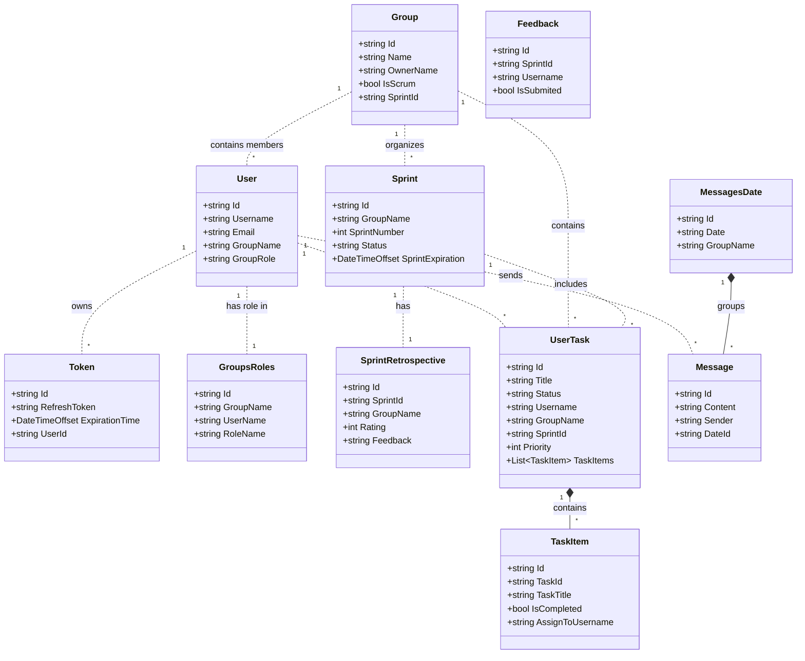
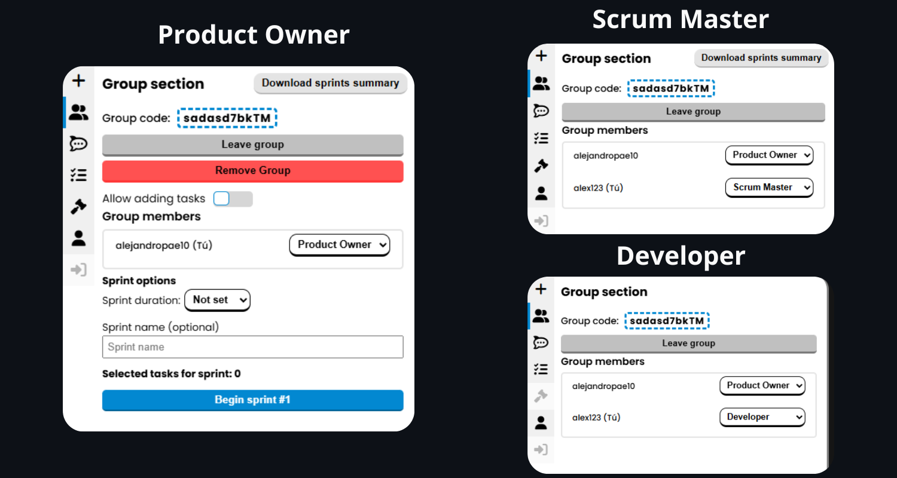
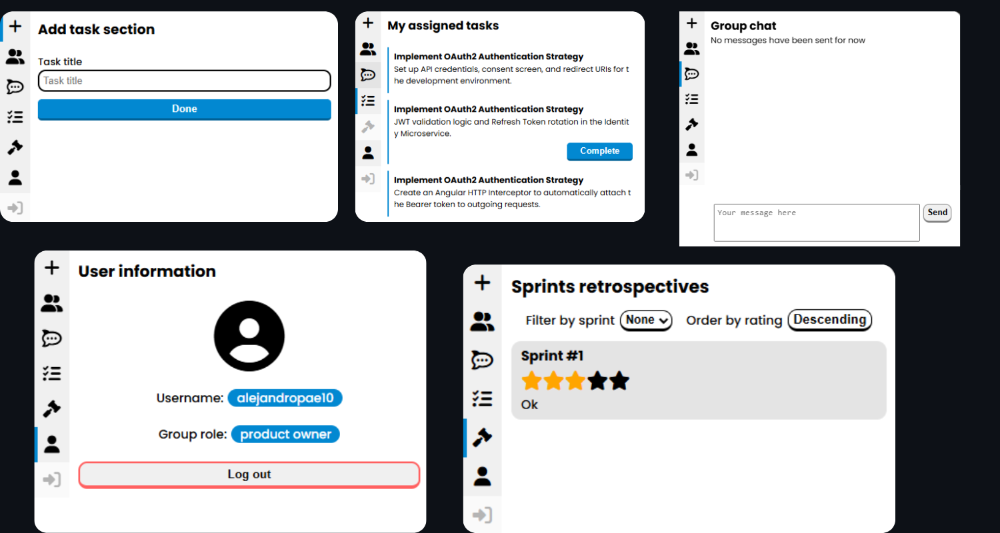
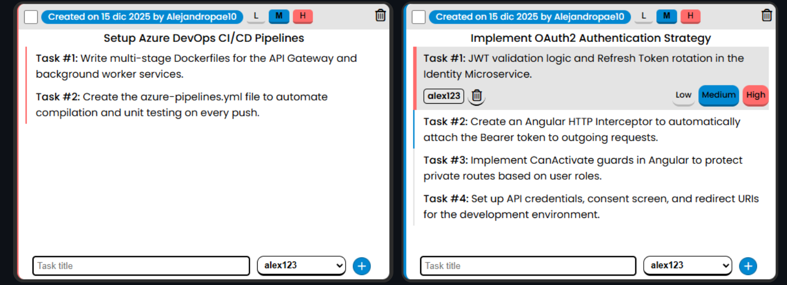
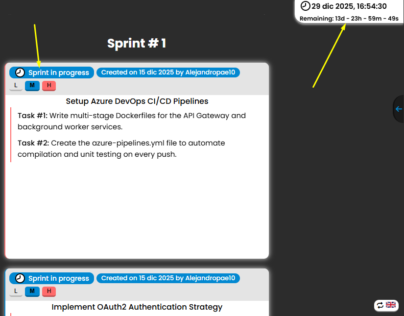
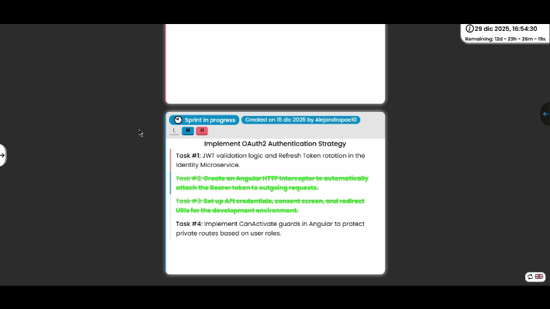
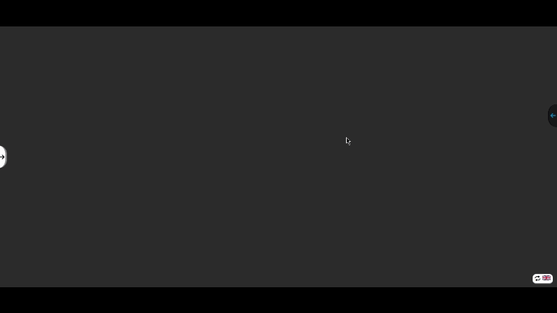
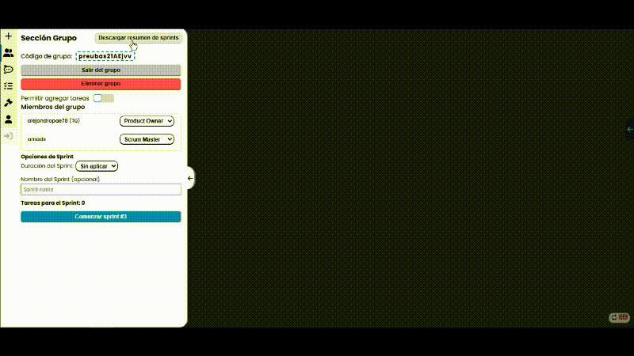

  

# Gestor de tareas colaborativo con enfoque en la metodología SCRUM

Gestor de tareas colaborativo aplicado a la metodología SCRUM.

# Tecnologías

*   **Frontend:** Angular, CSS.
*   **Backend:** ASP.NET Core, C#.
*   **Datos:** MongoDB.
*   **Integración IA:** API de Gemini para asistencia inteligente en la organización de tareas.
*   **DevOps:** Azure DevOps, Docker.
*   **Testing:** Pruebas unitarias implementadas con xUnit y FluentAssertions para casos de prueba robustos y legibles.

# Arquitectura y secciones de usuario

## Arquitectura

Arquitectura de microservicios distribuida robusta enfocada en la escalabilidad.

*   **API Gateway:** Implementación personalizada para enrutamiento y seguridad centralizada.
*   **Comunicación entre servicios:** Enfoque híbrido utilizando HTTP síncrono (con Polly para reintentos y resiliencia) y mensajería asíncrona vía RabbitMQ para asegurar consistencia eventual.
*   **Seguridad:** Integración OAuth2 (Google) y manejo centralizado de JWT con Refresh Tokens.
*   **Tiempo real:** Integración de SignalR para actualizaciones en vivo en los tableros de tareas.

## Esquema de datos distribuido

# Secciones

## Sección de Grupo basada en Roles
Dependiendo de su rol, cada usuario tiene opciones específicas disponibles dentro de la sección de grupo:

## Sección Agregar Tarea (Backlog)
Los usuarios pueden agregar tareas al Backlog para ser realizadas durante un Sprint.

## Mis Tareas Asignadas
Los usuarios pueden ver una lista de tareas pendientes o asignadas a ellos en el grupo actual.

## Chat de Grupo
Los usuarios del grupo pueden enviar mensajes para facilitar la comunicación. Los mensajes se organizan por el día en que fueron enviados.

## Información de Usuario
Los usuarios pueden ver su rol dentro del grupo y su nombre de usuario.

## Retrospectivas
Se envía una Retrospectiva con respecto al Sprint completado.

## Preparación del Sprint Backlog
Aquí se preparan los Backlogs del Sprint que se ejecutarán durante un Sprint.

## Sprint Activo
Cuando comienza un Sprint, se resalta visualmente y se agrega un temporizador de cuenta regresiva que muestra el tiempo restante.

## Asistente Gemini API
Los usuarios pueden usar el Asistente de IA para ayudarles a completar sus tareas asignadas.

## Ordenamiento del Sprint Backlog
Los Backlogs se pueden ordenar según su prioridad.

## Retrospectiva del Sprint
Justo cuando finaliza un Sprint, los Desarrolladores y el Scrum Master pueden evaluar cómo se llevó a cabo el Sprint.

## Historial de Sprints
Se puede ver un historial de Sprints, detallando las tareas completadas y no completadas (Backlogs).

## Descargar Historial de Sprints como PDF
Está disponible un botón para descargar el informe del historial de Sprints.

# 🐳 Cómo ejecutar con Docker

Asegúrate de tener **Docker** y **Docker Compose** instalados en tu máquina.

1. Descarga los archivos `docker-compose.yml` y `.env`.
2. Abre una terminal en el directorio raíz del proyecto.
3. Ejecuta el siguiente comando: `docker-compose up -d`

## Configuración de Entorno

Para probar características externas específicas, debes actualizar los valores en el archivo `.env` antes de ejecutar los contenedores.

### Google Gemini API  
#### Si deseas utilizar las funciones de la API de Google, necesitas proporcionar tu propia API Key válida en la variable de entorno `GEMINI_API_KEY`.

### Notificaciones por correo para restablecimiento de contraseña
#### Para probar la funcionalidad de "Olvidé mi contraseña", necesitas configurar una cuenta de correo remitente. Para Gmail, debes usar una **Contraseña de Aplicación** (no tu contraseña de inicio de sesión), la cual puedes generar en *Cuenta de Google > Seguridad > Verificación en 2 pasos > Contraseñas de aplicaciones*. Luego, agrega tu correo de Google en `EMAIL` y la contraseña generada en `PASSWORD`.

## Estrategia de despliegue

### Microservicios (Desarrollo y Docker)
En entornos de desarrollo local y Docker, el sistema se ejecuta como una arquitectura de microservicios totalmente distribuida. Cada servicio (Identidad, Tareas, Gateway, etc.) opera en su propio contenedor, comunicándose a través de RabbitMQ y HTTP.

### Adaptación monolítica (Producción en Azure)
Para el despliegue, y para cumplir con las cuotas del `Azure Free Tier (F1)` (límites de CPU/RAM), los servicios se consolidaron en una única unidad de despliegue (Monolito).
*   **Estrategia de Pipeline:** El archivo `azure-pipelines.yml` incluido en la carpeta **TaskManagerMicroservices** demuestra la configuración de CI/CD para el enfoque de microservicios. Sin embargo, se ejecutó un pipeline simplificado para la compilación de producción, reutilizando la misma lógica de negocio y código de dominio pero desplegándolo como una aplicación unificada.

   
  
   

