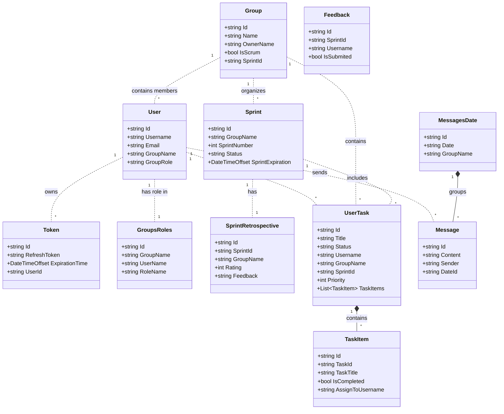

  

# Scrum Task Manager

Collaborative task manager applied to the SCRUM methodology.

# Tech stack

*   **Frontend:** Angular, CSS.
*   **Backend:** ASP.NET Core, C#.
*   **Data:** MongoDB.
*   **AI Integration:** Gemini API for intelligent task organization assistance.
*   **DevOps:** Azure DevOps, Docker.

# Architecture and user sections

## Arquitecture

Robust distributed microservices architecture focused on scalability.

*   **API Gateway:** Custom implementation for centralized routing and security.
*   **Inter-service communication:** Hybrid approach using synchronous HTTP (with Polly for retries/resilience) and asynchronous messaging via **RabbitMQ** to ensure eventual consistency.
*   **Security:** OAuth2 integration (Google) and centralized JWT handling with Refresh Tokens.
*   **Real-time:** Integration of **SignalR** for live updates on task boards.

## Distributed data schema

# Sections

## User-role-based Group Section
Depending on their role, each user has specific options available within the group section:

## Add Task (Backlog) Section
Users can add Backlog tasks to be carried out during a Sprint.

## My Assigned Tasks
Users can view a list of pending tasks or tasks assigned to them in the current group.

## Group Chat
Users in the group can send messages to facilitate communication. Messages are organized by the day they were sent.

## User Information
Users can view their role within the group and their username.

## Retrospectives
A Retrospective is submitted regarding the completed Sprint.

## Sprint Backlog Preparation
The Sprint Backlogs to be executed during a Sprint are prepared here.

## Active Sprint
When a Sprint starts, it is visually highlighted, and a countdown timer showing the remaining time is added.

## Gemini API Assistant
Users can use the AI Assistant to help them complete their assigned tasks.

## Sprint Backlog Sorting
Backlogs can be sorted according to their priority.

## Sprint Retrospective
Just once a Sprint finishes, Developers and the Scrum Master can evaluate how the Sprint was carried out.

## Sprints History
A history of Sprints can be viewed, detailing completed and uncompleted tasks (Backlogs).

## Download Sprints History as PDF
A button to download the Sprint history report is available.

# 🐳 How to Run with Docker

Ensure you have **Docker** and **Docker Compose** installed on your machine.

1. Download the `docker-compose.yml` and `.env` files.
2. Open a terminal in the project root directory.
3. Run the following command: `docker-compose up -d`

## Environment Configuration

To test specific external features, you must update the values in the `.env` file before running the containers.

### Google Gemini API  
#### If you want to use the Google API features, you need to provide your own valid API Key in the environment variable `GEMINI_API_KEY`
### Email notifications por password resetting 
#### To test the "Forgot Password" functionality, you need to configure a sender email account. For Gmail, you must use an **App Password** (not your login password), which you can generate in *Google Account > Security > 2-Step Verification > App passwords*. Then, set your Google email in `EMAIL` and the generated password in `PASSWORD`.

## Deployment strategy

### Microservices (Development & Docker)
In local development and Docker environments, the system runs as a fully distributed microservices architecture. Each service (Identity, Tasks, Gateway, etc.) operates in its own container, communicating via RabbitMQ and HTTP.

### Monolithic adaptation (Azure production)
For the live production demo on Azure, to adhere to the resource quotas of the `Azure Free Tier (F1)` (CPU/RAM limits), the services were consolidated into a single deployment unit (Monolith).
*   **Pipeline Strategy:** The `azure-pipelines.yml` included in the **TaskManagerMicroservices** folder demonstrates the CI/CD configuration for the microservices approach. However, a streamlined pipeline was executed for the production build, reusing the same business logic and domain code but deploying it as a unified application.

   
  
   

